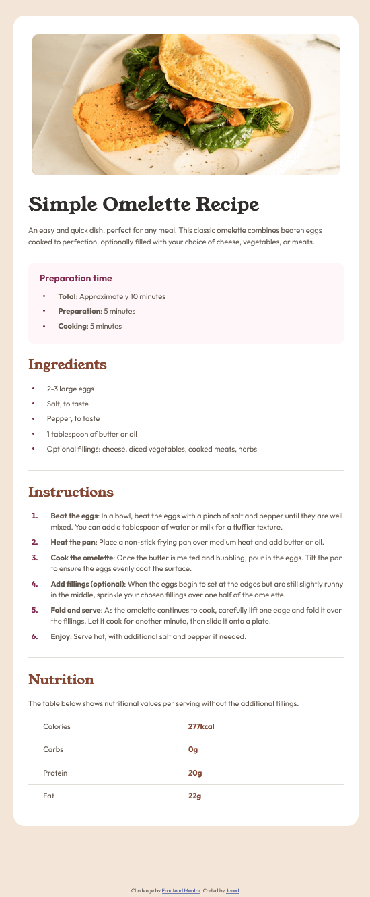

# Frontend Mentor - Recipe page solution

This is a solution to the [Recipe page challenge on Frontend Mentor](https://www.frontendmentor.io/challenges/recipe-page-KiTsR8QQKm). Frontend Mentor challenges help you improve your coding skills by building realistic projects.

## Table of contents

- [Overview](#overview)
  - [The challenge](#the-challenge)
  - [Screenshot](#screenshot)
  - [Links](#links)
- [My process](#my-process)
  - [Built with](#built-with)
  - [What I learned](#what-i-learned)
  - [Continued development](#continued-development)
  - [Useful resources](#useful-resources)
- [Author](#author)
- [Acknowledgments](#acknowledgments)

## Overview

### Screenshot

### Links

- Solution URL: [https://github.com/virus0bt/recipe-page-project]
- Live Site URL: [https://virus0bt.github.io/recipe-page-project/]

## My process

### Built with

- Semantic HTML5 markup
- CSS custom properties
- Flexbox
- Mobile-first workflow
- BEM class names

### What I learned

- How to organize simple website layout.
- Usage of CSS custom properties.
- How to work with Figma Prototypes and Design System.
- How to work with lists, basic and advanced.
- How to work with tables.

### Continued development

In future projects I want to learn more about accessibility and BEM naming convention in more complex designs. I also want to know more about advanced custome properties usage and new css features. I plan to spend more time on learning and comparing Flexbox and Grid, to feel comfortable with using both interchangeably.

### Useful resources

- (https://developer.mozilla.org) - General source of information for developers.
- (https://css-tricks.com/) - Second great source of information regarding CSS.
- (https://chrisburnell.com/clamp-calculator/) - clamp() calculator by Chris Burnell.

## Author

- Website - Not yet
- Frontend Mentor - @virus0bt (Jared)

## Acknowledgments

All the users who liked my previous solutions.
